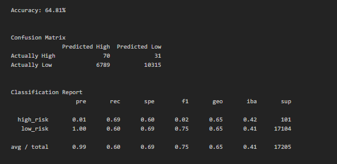
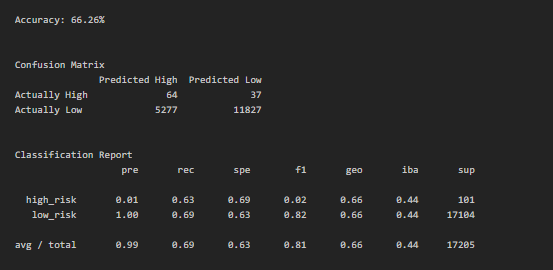
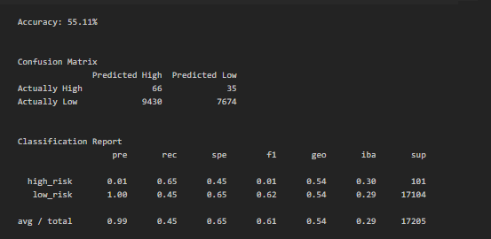
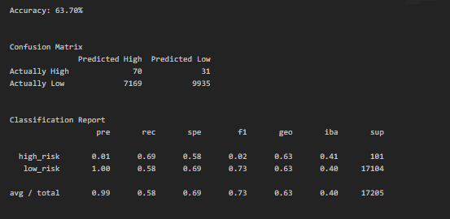
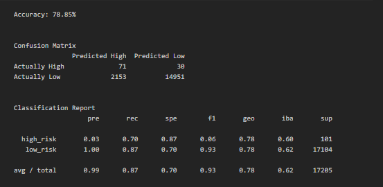
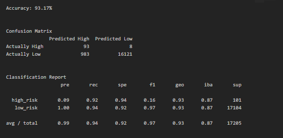

# Credit Risk Analysis: testing different resampling techniques to improve the accuracy of a logistic machine learning algorithm

## Overview
Peer lending service Fast Lending want to use a machine learning algorithm to predict which individuals are likely to repay their loans and which are likely to default.  However, the data set has a limited number of defaulted loans, as most people repay their debts.  I was tasked with testing a series of resampling methods with a logistic machine learning model to find the best resampling techniques for the dataset.  After that, two ensemble models will be tested against the data.  The best models should be evaluated to decide which (if any) algorithm will make accurate predictions about which customers will have a high credit risk.

## Results
- Model A: Accuracy-64.81%, High Risk Precision-1%, High Risk Recall-69%,
Low Risk Precision-100%, Low Risk Recall-60%
- Model B: Accuracy-66.26%, High Risk Precision-1%, High Risk Recall-63%,
Low Risk Precision-100%, Low Risk Recall-69%
- Model C: Accuracy-55.11%, High Risk Precision-1%, High Risk Recall-65%,
Low Risk Precision-100%, Low Risk Recall-45%
- Model D: Accuracy-63.70%, High Risk Precision-1%, High Risk Recall-69%,
Low Risk Precision-100%, Low Risk Recall-58%
- Model E: Accuracy-78.85%, High Risk Precision-3%, High Risk Recall-70%,
Low Risk Precision-100%, Low Risk Recall-87%
- Model F: Accuracy-93.17%, High Risk Precision-9%, High Risk Recall-92%,
Low Risk Precision-99%, Low Risk Recall-94%

**Table 1:** Model A - Logistic regression model with naive random oversampling.

**Table 2:** Model B - Logistic regression model with SMOTE oversampling.

**Table 3:** Model C - Logistic regression model with cluster centroids undersampling.

**Table 4:** Model D - Logistic regression model with SMOTEENN combined over- and undersampling.

**Table 5:** Model E - Balanced Random Forest Classifier model.

**Table 6:** Model F - Easy Ensemble AdaBoost Classifier model.

## Summary
### Sampling Methods
Between models A, B, C, and D, different sampling methods led to similar outcomes.  Naïve sampling (Model A) performed the best of the four models, because it had an equivalent precision and recall for the High Risk group as the next best model (Model D), but is showed higher Recall for the Low Risk group than Model D.  Model B (SMOTE oversampling) showed higher recall for the Low Risk group than Model A, however it showed lower recall for the High Risk group than Model A.  For this use case, models should be optimized for detecting High Risk over Low Risk, so Model A is still a better choice than Model B.  Model C (undersampling) showed the worst performance of the logistic models, with midrange recall for High Risk and the lowest recall for Low Risk, and the lowest accuracy of any model tested.  Thus, naïve random sampling was the best sampling resampling method for this data set, with an added bonus of running faster than the techniques that implemented SMOTE techniques.
### Model Choice
The model that unquestionable performed the best was Model F, with a recall of 92% and precision of 9% for High Risk and precision of 99% and recall of 94% for Low Risk, creating a model with an overall accuracy of 93%.  This is a very high performing model, given that the threshold for a strong model is 70% accurate.  **I would recommend the use of Model F** in choosing which loan applications to investigate further.  It infrequently miscategorized high credit risk as low credit risk (about 8% of the fraudulent cases were missed), so most High Risk loans will be identified.  Of the applications the model identified as potentially high risk, only about 10% were actually high risk, so this model should not be used alone to make a decision about whether a loan should be rejected or not, because many good loans would be rejected.  However, it calls attention to which applications should be examined more closely.  This task could be undertaken manually, or these data could be passed to a second algorithm to reduce the number of Low Risk applications in the final pool of applications to potentially reject.
